<div align="center">

  

  # 🌸 NutriGrad-MatriCare
  ### Maternal Health & Clinical AI Nutrition Risk Intelligence Platform

  <p align="center">
    <strong>An enterprise-grade, clinical-decision-support platform integrating Explainable Machine Learning (FastAPI), Role-Based Access Control (Django REST Framework), and an interactive Patient & Doctor web interface (React 18 + Vite + Tailwind CSS).</strong>
  </p>

  [](https://github.com/Rokibul-Islam-Robi/NutriGrad-MatriCare)
  [](https://www.python.org)
  [](https://fastapi.tiangolo.com)
  [](https://www.djangoproject.com)
  [](https://react.dev)
  [](https://tailwindcss.com)
  [](https://www.docker.com)
  [](LICENSE)

  <p align="center">
    <a href="#-system-overview">Overview</a> •
    <a href="#-key-features">Key Features</a> •
    <a href="#-system-architecture">Architecture</a> •
    <a href="#-machine-learning-engine">ML Engine</a> •
    <a href="#-project-structure">Project Structure</a> •
    <a href="#-quick-start-guide">Quick Start</a> •
    <a href="#-api-reference">API Docs</a> •
    <a href="#-demo-credentials">Demo Logins</a> •
    <a href="#-license">License</a>
  </p>

</div>

---

## 🩺 System Overview

**NutriGrad-MatriCare** is an intelligent maternal healthcare ecosystem engineered to bridge the critical gap between routine pregnancy observations and proactive, evidence-based clinical risk stratification. 

By analyzing antenatal physiological biomarkers (Hemoglobin, Blood Pressure, Fasting Blood Sugar, Body Mass Index, Protein Intake, and Maternal Age), the platform delivers real-time risk classification into **Low Risk**, **Mid Risk**, and **High Risk** tiers paired with targeted nutritional prescriptions, automated clinical CDSS alerts, and longitudinal maternal telemetry.

```mermaid
graph TD
    A[NutriGrad-MatriCare Core] --> B[🌸 Maternal Patient Suite]
    A --> C[🩺 Doctor & Obstetrician Cockpit]
    A --> D[🛡️ Hospital Admin Console]
    
    B --> B1[3-Column AI Risk Predictor]
    B --> B2[Trimester Nutrition & Diet Prescriptions]
    B --> B3[Week 4-40 Fetal Growth Milestone Tracker]
    B --> B4[Prenatal Micronutrient Adherence System]
    B --> B5[24/7 Maternal AI Chatbot & Telehealth]

    C --> C1[Antenatal Cohort Triage Queue]
    C --> C2[EHR Telemetry & Clinical Vital Charts]
    C --> C3[Official e-Prescription e-Rx Generator]
    C --> C4[Biomarker What-If Scenario Simulator]
    C --> C5[Encrypted Telehealth Consultation Suite]

    D --> D1[FastAPI & Django Gateway Telemetry]
    D --> D2[Staff RBAC Privilege Management]
    D --> D3[HIPAA Security & Audit Logs]
    D --> D4[One-Click Automated ML Retraining]
```



---

## 🚀 Key Features

### 1. 🌸 Maternal Patient Suite
* **3-Column AI Risk Evaluator**: Instant assessment of Hemoglobin, Blood Pressure, Fasting Glucose, BMI, and Protein Intake with live percentage distribution.
* **Downloadable & Printable Clinical Reports**: Export tamper-evident, formatted diagnostic PDF summaries with AI confidence scores, hemodynamic markers, and clinician sign-off zones.
* **Trimester-Tailored 6-Meal Nutrition Plans**: Customized dietary schedules highlighting core pregnancy micronutrients (Folate, Iron, Calcium + D3, Omega-3 DHA) alongside high-risk food contraindication flags.
* **Week 4 to 40 Fetal Milestone Tracker**: Weekly developmental benchmarks comparing fetal dimensions with fruit sizes, maternal bodily changes, and critical danger signs.
* **Prenatal Micronutrient Adherence Tracker**: Daily checklist for prenatal vitamins, iron, and folic acid with adherence streak tracking.
* **24/7 Maternal AI Assistant**: Conversational health guidance for morning sickness, gestational diabetes management, hypertension, and emergency triage.

### 2. 🩺 Doctor & Obstetrician Cockpit (`/doctor-portal`)
* **Antenatal Cohort Triage Board**: High, Mid, and Low-risk cohort filtering by gestational age and blood group.
* **Electronic Health Record (EHR) Drilldown**: Live vital graphs, Mean Arterial Pressure (MAP) estimation, pulse pressure analysis, and longitudinal checkup logs.
* **Official e-Prescription (e-Rx) Studio**: Digital prescription builder with **FDA Pregnancy Risk Categories (Cat A, B, C, D, X)** and cryptographic digital signatures.
* **Biomarker What-If Scenario Simulator**: Interactive vital sliders simulating clinical outcome shifts post-nutritional or pharmacological interventions.
* **Virtual Video Clinic**: Appointment scheduling and direct encrypted video room launcher for remote maternal consultations.

### 3. 🛡️ Hospital Administration Console (`/admin-portal`)
* **Cluster & Service Telemetry**: Real-time heartbeat monitoring for FastAPI ML Engine (Port 8001) and Django Gateway (Port 8000).
* **Staff RBAC Management**: Suspend, activate, or create Doctor and Clinician accounts with role-based permission sets.
* **HIPAA Security & Audit Logs**: Chronological authentication tracking and diagnostic query logs with CSV export.
* **ML Model Governance**: Real-time metrics on training dataset records (1,014 samples), 5-Fold Stratified Cross-Validation metrics, and one-click retraining triggers.

---

## 🧬 Machine Learning Engine

```
Raw Biomarkers (Age, BMI, Hb, BP, Sugar, Protein)
                      │
                      ▼
   ┌────────────────────────────────────────┐
   │  Advanced Clinical Feature Engineering │
   │  • Mean Arterial Pressure (MAP)        │
   │  • Pulse Pressure (SBP - DBP)          │
   │  • Hemoglobin Anemia Severity Index    │
   │  • Glycemic Risk Category (GDM Triage) │
   │  • Protein Intake Deficit Score        │
   │  • Maternal Age Risk Stratification    │
   └───────────────────┬────────────────────┘
                       │
                       ▼
   ┌────────────────────────────────────────┐
   │     SMOTE Synthetic Oversampling       │
   │    (Mitigate Clinical Class Imbalance) │
   └───────────────────┬────────────────────┘
                       │
                       ▼
   ┌────────────────────────────────────────┐
   │     Random Forest Ensemble Pipeline    │
   │      • RobustScaler Normalization      │
   │      • 5-Fold Stratified CV            │
   │      • Probability Distribution Output │
   └───────────────────┬────────────────────┘
                       │
                       ▼
    Risk Level + Confidence + Evidence-Based CDSS Flags
```

### Engineered Clinical Features:
| Feature Name | Clinical Significance | Normal / Optimal Range |
| :--- | :--- | :--- |
| `BMI_Category` | WHO Maternal Weight Standards | $18.5 - 24.9 \text{ kg/m}^2$ |
| `Anemia_Severity` | WHO Gestational Anemia Index | $\ge 11.0 \text{ g/dL}$ |
| `BP_Stage` | Maternal Hypertension Staging | $\text{SBP} < 120, \text{ DBP} < 80$ |
| `Est_MAP` | Mean Arterial Pressure | $70 - 95 \text{ mmHg}$ |
| `Est_PulsePressure` | Hemodynamic Vascular Compliance | $30 - 50 \text{ mmHg}$ |
| `Glycemic_Category` | Gestational Diabetes Screening | $< 100 \text{ mg/dL}$ (Fasting) |
| `Protein_Deficit_Score`| Antenatal Protein Target Deficit | $\ge 71 \text{ g/day}$ |
| `Maternal_Age_Risk` | Adolescent / Advanced Age Risk | $19 - 34 \text{ years}$ |

---

## 📁 Project Structure

```
NutriGrad-MatriCare/
├── LICENSE                         # Official MIT License (Rokibul Islam)
├── README.md                       # Comprehensive project documentation
├── docker-compose.yml              # Multi-container orchestration (Postgres, FastAPI, Django, React)
├── vercel.json                     # Monorepo SPA build & routing configuration
├── .env.example                    # Environment template
├── dataset/
│   └── data.csv                    # Antenatal clinical training dataset
├── ml_engine/                      # FastAPI Machine Learning Microservice (Port 8001)
│   ├── Dockerfile
│   ├── requirements.txt
│   ├── train_pipeline.py           # Preprocessing, Feature Engineering & SMOTE Pipeline
│   ├── model/
│   │   ├── risk_pipeline.joblib    # Serialized production ensemble model
│   │   ├── feature_names.joblib    # 14-Feature schema vector
│   │   └── metrics.json            # Accuracy, F1, & ROC-AUC metadata
│   └── service/
│       ├── main.py                 # FastAPI endpoints (/predict-and-analyze, /health, /retrain)
│       └── schemas.py              # Pydantic validation schemas
├── backend/                        # Django REST Framework Enterprise Gateway (Port 8000)
│   ├── Dockerfile
│   ├── requirements.txt
│   ├── manage.py
│   ├── seed_data.py                # Database population script
│   ├── core/                       # Settings, JWT rotation, CORS, URLs, ASGI/WSGI
│   ├── authentication/             # Custom User model & RBAC permissions
│   ├── patients/                   # Patient records, assessments, EHR, & analytics
│   └── tests/                      # Automated Pytest test suite
└── frontend/                       # React 18 + Vite + Tailwind CSS (Port 3000)
    ├── package.json
    ├── vite.config.js
    ├── tailwind.config.js
    ├── public/
    │   ├── nutrigrad_matricare_logo.png
    │   ├── favicon.png
    │   └── mother_baby_illustration.png
    └── src/
        ├── api/axiosClient.js      # Axios instance with auto-refresh JWT interceptors
        ├── context/AuthContext.jsx # RBAC state and session management
        ├── components/             # NutriGradMatriCareLogo, Modals, Charts, Badges
        ├── pages/                  # Predictor, DoctorPortal, AdminPortal, NutritionPlan, etc.
        └── App.jsx                 # Role-based protected router
```

---

## 🛠️ Quick Start Guide

### Option 1: Docker Compose (Recommended)

```bash
# 1. Clone the repository
git clone https://github.com/Rokibul-Islam-Robi/NutriGrad-MatriCare.git
cd NutriGrad-MatriCare

# 2. Setup environment configuration
cp .env.example .env

# 3. Launch all microservices
docker-compose up --build
```

Access the running services:
* 🌐 **Frontend Application**: `http://localhost:3000`
* 🔌 **Django REST API**: `http://localhost:8000/api`
* ⚡ **FastAPI ML Swagger Docs**: `http://localhost:8001/docs`

---

### Option 2: Local Development Setup

#### 1. Machine Learning Microservice (FastAPI)
```bash
# Terminal 1
python ml_engine/train_pipeline.py
python -m uvicorn ml_engine.service.main:app --host 127.0.0.1 --port 8001 --reload
```

#### 2. Enterprise Backend Gateway (Django REST)
```bash
# Terminal 2
cd backend
python manage.py makemigrations authentication patients
python manage.py migrate
python seed_data.py
python manage.py runserver 127.0.0.1:8000
```

#### 3. Modern Frontend UI (React + Vite)
```bash
# Terminal 3
cd frontend
npm install
npm run dev
```

Open `http://localhost:3000` in your web browser.

---

## 🔑 Demo Credentials

| Role | Username | Password | Default Landing | Permitted Capabilities |
| :--- | :--- | :--- | :--- | :--- |
| 🌸 **Mother / Patient** | `patient_sarah` | `MotherPass123!` | `/predictor` | ML Risk Evaluator, Meal Plan, Fetal Tracker, Vitamin Log, Telehealth |
| 🩺 **Doctor / Obstetrician** | `dr_sarah` | `DoctorPass123!` | `/doctor-portal` | Triage Queue, EHR Drilldown, e-Rx Prescriptions, What-If Simulator |
| 🛡️ **Hospital Administrator** | `admin_sys` | `AdminPass123!` | `/admin-portal` | Service Telemetry, Staff RBAC, HIPAA Audit Logs, Model Retraining |

---

## 🔌 API Reference Summary

### Authentication & RBAC (`/api/auth/`)
| Method | Endpoint | Description |
| :--- | :--- | :--- |
| `POST` | `/api/auth/token/` | Obtain JWT access and refresh token pair |
| `POST` | `/api/auth/token/refresh/` | Refresh expired access token |
| `POST` | `/api/auth/register/` | Register new clinician, doctor, or administrator |
| `GET` | `/api/auth/users/` | List hospital staff (Admin only) |

### Clinical Assessments & EHR (`/api/`)
| Method | Endpoint | Description |
| :--- | :--- | :--- |
| `POST` | `/api/assessments/evaluate/` | Submit vital telemetry & receive ML risk classification |
| `GET` | `/api/assessments/` | Retrieve historical assessment logs with filters |
| `GET` | `/api/patients/` | Paginated patient registry with risk indicators |
| `GET` | `/api/analytics/` | Population-wide risk distribution & biomarker statistics |

### ML Inference Microservice (`:8001`)
| Method | Endpoint | Description |
| :--- | :--- | :--- |
| `POST` | `/predict-and-analyze` | Direct inference with probability vector and CDSS flags |
| `GET` | `/health` | Microservice liveness and model status |
| `POST` | `/retrain` | Trigger asynchronous pipeline retraining with fresh dataset |

---

## 🧪 Automated Testing

Run the comprehensive Pytest backend suite:
```bash
cd backend
pytest -v
```

---

## 📄 License

This project is licensed under the **MIT License** — see the [LICENSE](LICENSE) file for details.

```
MIT License
Copyright (c) 2025-2026 Rokibul Islam
```

<div align="center">
  <sub>Developed with ❤️ for Maternal Health & Fetal Wellbeing by <strong><a href="https://github.com/Rokibul-Islam-Robi">Rokibul Islam</a></strong></sub>
</div>
